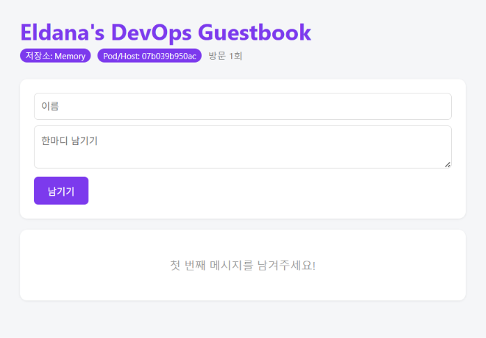
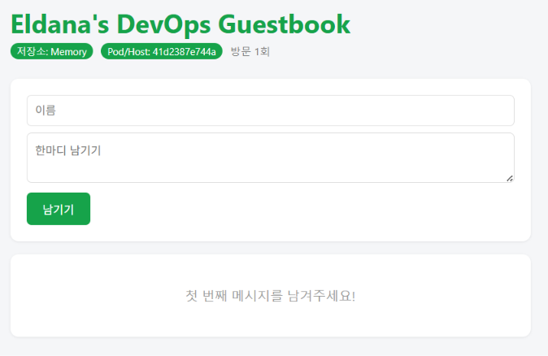
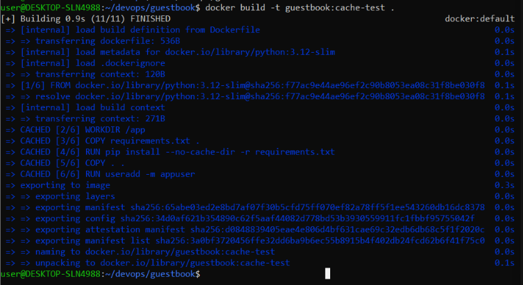

# Week 06 - Dockerfile

## 1. Guestbook V2

Dockerfile과 HTML을 수정하여 Guestbook을 커스터마이징하였다.

- `APP_TITLE` → `Eldana's DevOps Guestbook`
- `THEME_COLOR` → `#7C3AED`
- 빈 방명록 문구 수정



### GHCR

```text
ghcr.io/e-shitorin/guestbook:v2
```

```bash
docker build -t guestbook:v2 .
docker tag guestbook:v2 ghcr.io/e-shitorin/guestbook:v2
docker push ghcr.io/e-shitorin/guestbook:v2
```

## 2. ENV 확인

```bash
docker run -d -p 8083:5000 \
  --name gbv2 \
  -e THEME_COLOR="#16a34a" \
  guestbook:v2
```

`docker run -e`를 사용하면 Dockerfile의 기본 `ENV` 값보다
실행 시 전달한 환경변수가 우선 적용된다.



```text
app.py 기본값 < Dockerfile ENV < docker run -e
```

## 3. Dockerfile.custom

기존 이미지를 `FROM`으로 사용하여 새로운 이미지를 만들었다.

```dockerfile
FROM ghcr.io/e-shitorin/guestbook:v2

ENV APP_TITLE="Eldana Custom Guestbook" \
    THEME_COLOR="#7C9A82"
```

```bash
docker build -f Dockerfile.custom -t guestbook:custom .
docker run -d -p 8082:5000 --name custom guestbook:custom
```

`docker history`를 사용하여 Image Layer를 확인하였다.

## 4. Dockerfile 주요 명령어

- `FROM` : 기본 이미지 지정
- `WORKDIR` : 작업 디렉터리 지정
- `COPY` : 파일 복사
- `RUN` : 빌드 중 명령 실행
- `ENV` : 환경변수 설정
- `EXPOSE` : 포트 표시
- `CMD` : 컨테이너 실행 명령
- `USER` : 실행 사용자 지정

## 5. Docker Cache

다시 빌드하여 `CACHED` Layer를 확인하였다.

```text
CACHED [2/6] WORKDIR /app
CACHED [3/6] COPY requirements.txt .
CACHED [4/6] RUN pip install --no-cache-dir -r requirements.txt
```

변경되지 않은 Layer는 Cache를 재사용하여 빌드 시간을 줄일 수 있다.



## 6. Git

```bash
git add guestbook week06
git commit -m "week06: Dockerfile & ghcr.io 배포"
git push

git tag week06
git push origin week06
```
